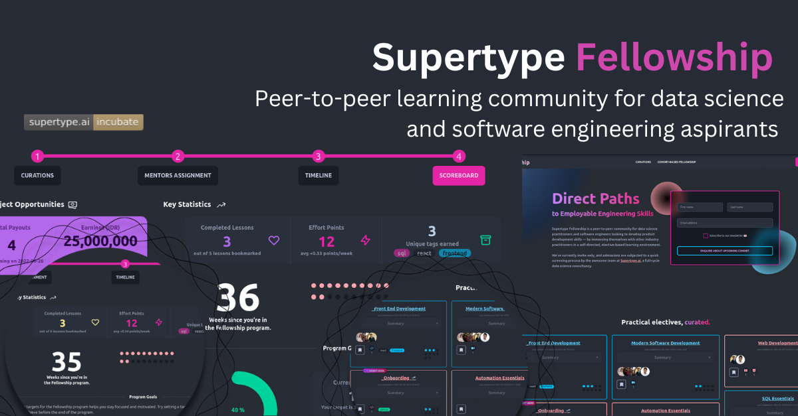

 &nbsp; &nbsp; 

# Supertype Fellowship
[Supertype Fellowship](https://fellowship.supertype.ai) is a development program for aspiring analytics developers, data scientists and software engineers looking to build a fulfilling career in these domains. The program features a combination of expert mentoring, peer-to-peer learning, and plenty of self-directed learning from a collection of curated learning resources.

Participants learn analytics and software engineering by building real-world projects with a community of peers and mentors. The program is largely self-paced, and participants will be able to choose from a variety of learning paths in a buffet-style format. There is no homework, no assignments, no deadlines, and no grades. Instead, participants are taught to ship real features and products, just like they would as a software engineer in the real world. Instead of being graded on some arbitrary multiple choice questions, they will receive code reviews by their peers and expert mentors to help them acclimate to production-level data science and software engineering.

This is a program by [Supertype (Data Science Consultancy)](https://supertype.ai) and is run in adherence to our [Philosophy](https://supertype.ai/about-us/).

## Development (for contributors)

This project was bootstrapped with [Create React App](https://github.com/facebook/create-react-app).

Install the dependencies for this project with `yarn install`. In the project directory, you can run:

### `yarn start`

Runs the app in the development mode.\
Open [http://localhost:3000](http://localhost:3000) to view it in your browser.

The page will reload when you make changes.

### `yarn build`

Builds the app for production to the `build` folder.\
It correctly bundles React in production mode and optimizes the build for the best performance.

The build is minified and the filenames include the hashes.